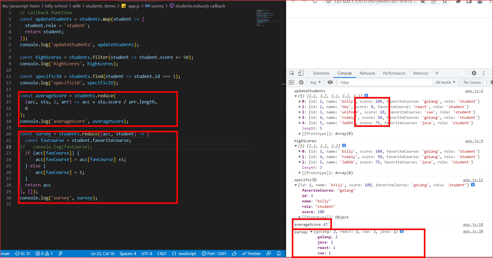
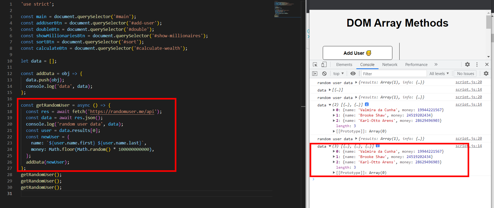
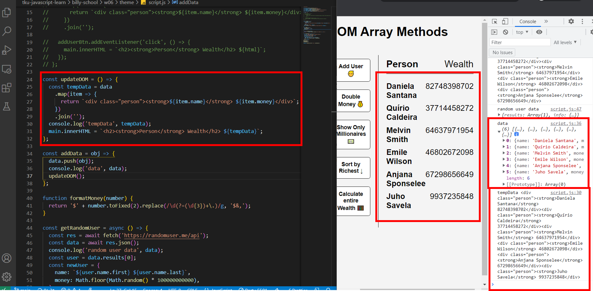
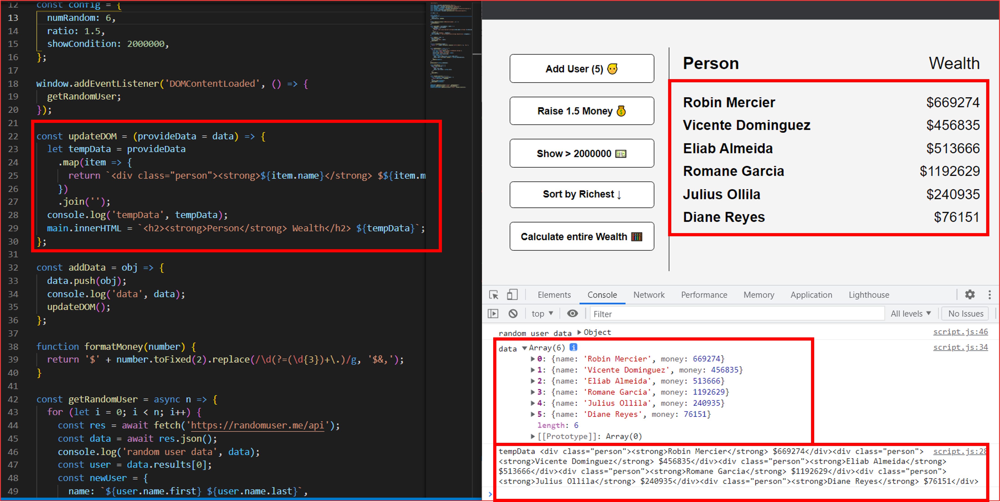
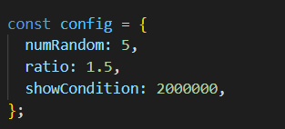
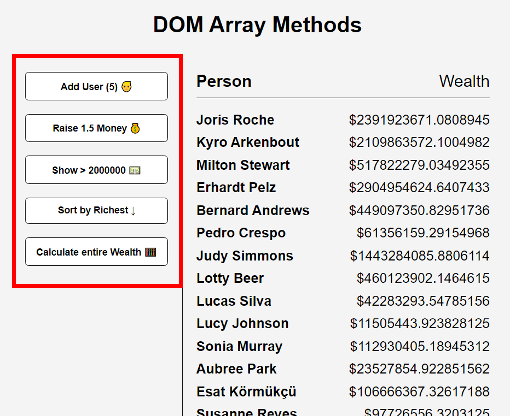

### P1: students array demo using map, filter, find, reduce

### P2: getRandomUser three times

### P3: add 6 users to the DOM

### P4: add 6 users first, then filter condition set to > 30000000

### P5: use config for three buttons

