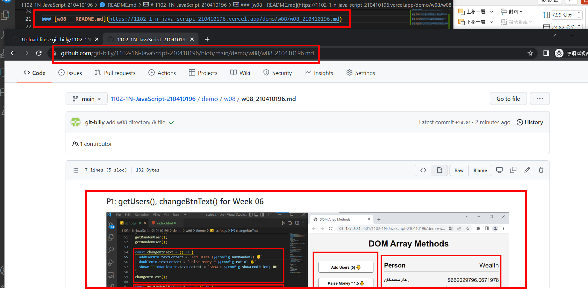
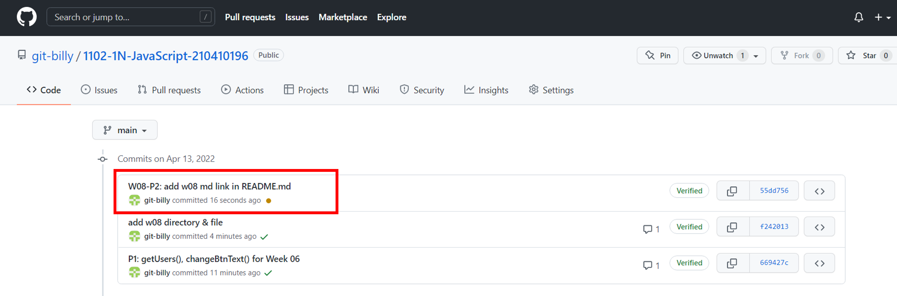
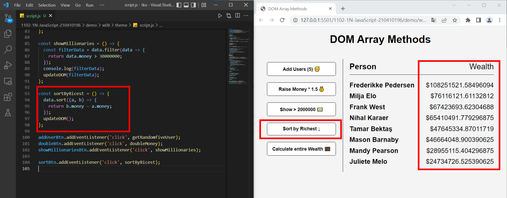
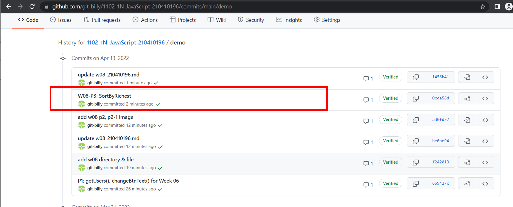
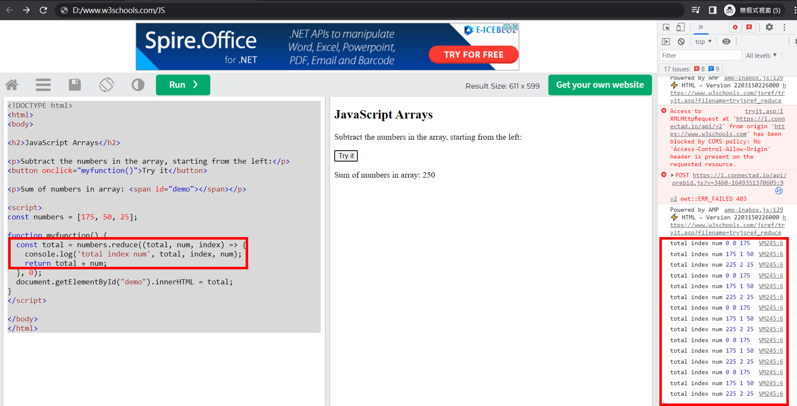
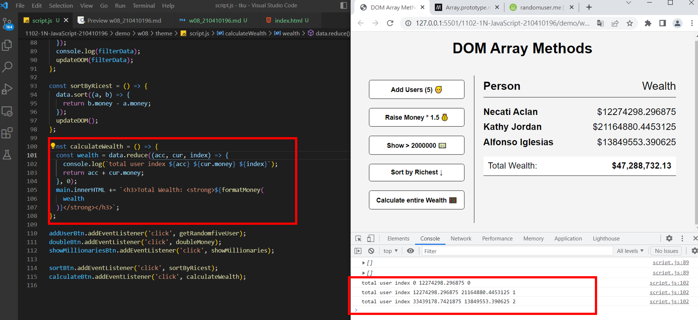
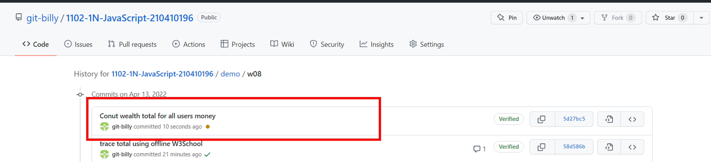

### P1: getUsers(), changeBtnText() for Week 06

### W08-P2: add w08 md link in README.md

### W08-P3: SortByRichest

### W08-P4: trace total using offline W3School

### W08-P5: Conut wealth total for all users money

