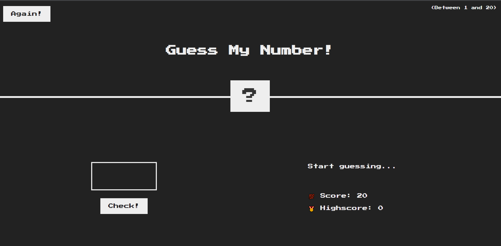
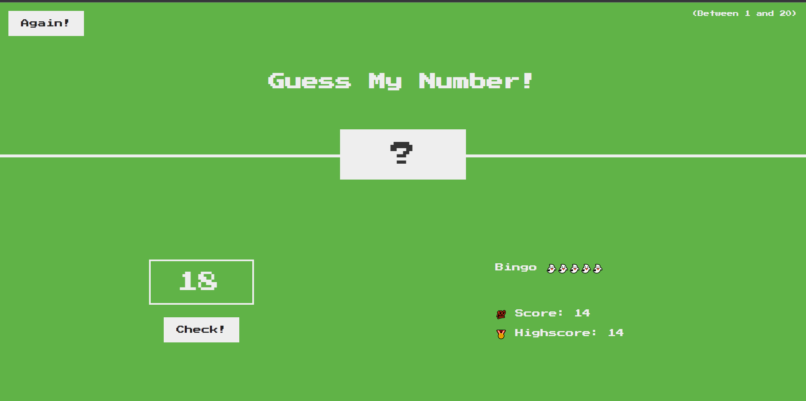

## Screen

### Initial


### Success


### Fail


### Initial / Success / Fail Code
```javascript
const checkResult = () => {
  document.querySelector('.check').addEventListener('click', () => {
    const guess = Number(guessNumber.value);
    
    // console.log("typeof guess: ", typeof guess);

    // 0 = false, 1 = true
    // console.log("Boolean: ", Boolean(guess));

    if (!guess) {
      // console.log("!guess: ", !guess);
      showMessage('No input number');
    } else if (guess === randomNumber) {
      // console.log(typeof (guess === secretNumber));
      showMessage(`Bingo ${'👻'.repeat(5)}`);
      bingo.style.backgroundColor = '#60b347';
      showNumber.style.width = '30rem';

      highscore = score;
      highscoreValue.textContent = highscore;

    } else if (guess !== randomNumber) {
      if (score > 1) {
        score--;
        // console.log("debug", score);
        scoreValue.textContent = score;
        showMessage(guess > randomNumber ? 'number too high' : 'number too low');
      } else if (score >= 1) {
        scoreValue.textContent = 0;
        showMessage('you lose this game');
      }
    }
  });
};
```

### Again Code
```javascript
const againing = () => {
  againbutton.addEventListener('click', () => {
    score = 20;

    showMessage('Start guessing...');
    scoreValue.textContent = score;
    guessNumber.value = '';
    showNumber.textContent = '?';
    bingo.style.backgroundColor = '#222';
    highscoreValue.textContent = 0;
  });
};
```

---

## 甘苦談:
我認為這 "HW1" 難度對於剛入門的新手來說非常的困難～